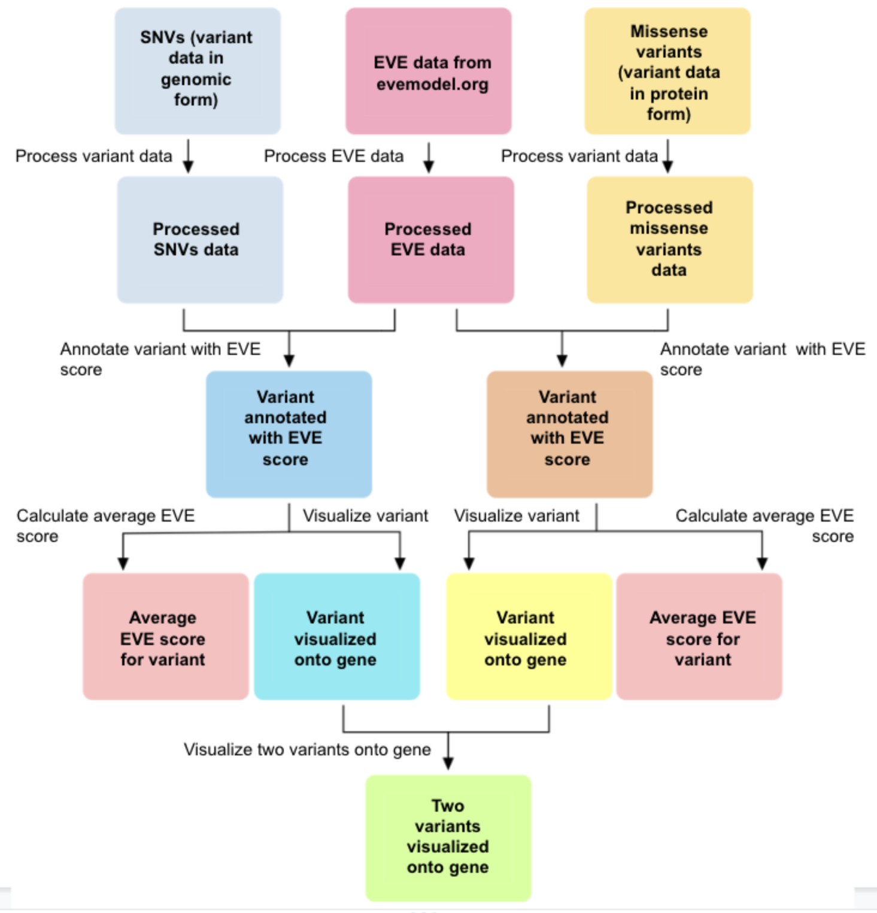

<!-- README.md is generated from README.Rmd. Please edit that file -->

```{r, include = FALSE}
knitr::opts_chunk$set(
  collapse = TRUE,
  comment = "#>",
  fig.path = "man/figures/README-",
  out.width = "100%"
)
```

# variantMapper

<!-- badges: start -->
<!-- badges: end -->

## Description

The goal of variantMapper is to make variant pathogenicity predictions from the Evolutionary model of Variant Effect (EVE) more accessible allowing for one source of variant pathogenicity predictions to be easily accessed.  

EVE is an unsupervised machine learning model shown to be accurate in its predictions and doesn't rely on knowledge of protein function.  It uses multiple sequence alignments to predict pathogenicity of missense variants.  However, there are challenges with using EVE's data.  If one wants to assign predicted pathogenicity scores (EVE scores) from EVE they must download the EVE data for that gene and manually find the mutations corresponding to their variants.  This is especially challenging for single nucleotide variants (SNVs).  More about EVE can be found at the [EVE website](https://evemodel.org/).  

variantMapper makes this process efficient and provides a visualization aspect to map variants to a gene.  By making it easier to get a source of pathogenicity predictions for variants this can guide downstream analyses on which variants and regions of a gene to focus on saving both time and efforts.  Additionally, it can serve as one form of validation for related studies.  Currently, there are no tools to make the process of using data generated from EVE easy and efficient to use.  Moreover, EVE does not provide a visualization aspect for examining specific variants.

```r
R version 4.2.1 (2022-06-23)
Platform: x86_64-apple-darwin17.0 
Running under: macOS Big Sur 11.5.2
```
## Installation

To install the latest version of the package:

```r
require("devtools")
devtools::install_github("theangelang/variantMapper", build_vignettes = TRUE)
library("variantMapper")
```

To run the shinyApp:

```r
runVariantMapper()
```

## Overview

```r
ls("package:variantMapper")
browseVignettes("variantMapper")
```

variantMapper contains six functions that aid in the process of using data from EVE, analyzing, and visualizing variants.  There is one function to run a Shiny app.

The `processEveData` function processes the data from EVE and ensures it is in the proper form for use in the future.  The user must go to the [EVE website](https://evemodel.org/), search for their gene of choice and download the vcf file.

The `processVariantData` function can take in variant data in either protein form or genomic form.  If the variants are in protein form this refers to missense mutations where the wild type and alternate amino acids are listed in addition to residue position.  If the variants are in genomic form they will list the chromosome, start genomic position, end genomic position, reference allele, and alternate allele.  Note variantMapper currently only looks at missense mutations in protein form and SNVs for mutations in genomic form.

The `getEveScores` function assigns an EVE score to each residue with a possible EVE score based on the variant of interest.

The `scoreVariant` function returns a weighted average EVE score for the variant of interest.  This can be used to analyze overall pathogenicity of variant while placing more weight on specific locations.

The `visualizeVariant` function plots the EVE scores at each reside as a lollipop graph.

The `visualizeVariant2` function plots the EVE scores at each position for two variants in one lollipop graph.

The `runVariantMapper` function runs the Shiny App that allows users to do analysis and visualization of variants via a web interface.

An overview of the package is shown below:


## Contributions
The author of this package is Angela Ng.

### `processEveData` function
The `vcfR` package was used to read in the vcf file.  `dplyr, tibble, and stringr` are used for data manipulation.  My contributions for this function are reading in the data and processing it, such as by extracting information from columns, and organizing it into a usable form.

### `processVariantData` function
The `read.csv` function from the `utils` package was used to read in the csv file.  The `tibble` package was used for data manipulation.  My contributions are ensuring the data has the required columns depending on the type of variant data (protein or genomic) and organizing the data into a usable form.

### `getEveScores` function
The `dplyr, tibble`, and `setNames` from the `stats` package were used for data manipulation.  In this function my contributions were given a set of EVE data and variant data I matched the variants with an EVE score i.e. annotated the variants with an EVE score, if they had one, and for the given variant assigned a wild type and variant amino acid if it wasn’t provided.

### `scoreVariant` function
The `weighted.mean` function from the `stats` package and `hasArg` function from the `methods` package were used to calculate a weighted mean and verify the input respectively.  My contributions were verifying input data and in cases where it did not make sense I would substitute it with a default.

### `visualizeVariant` function
`ggplot2` was used to create the plot.  `dplyr` was used for data manipulation.  My contributions were ensuring the data was of the appropriate form and manipulating it.  In addition I used aspects of the `ggplot2` package to map a variant’s EVE scores to the residue position and color the EVE scores with a color corresponding to a pathogenicity scale where 1 represents most pathogenic and 0 benign.

### `visualizeVariant2` function
`ggplot2` was used to create the plot.  `dplyr` was used for data manipulation.  My contributions were ensuring the data was of the appropriate form and manipulating it.  Additionally, I used aspects of the `ggplot2` package to map two variants’ EVE scores to the residue position.

### `runVariantMapper` function
The RStudio Shiny Gallery and RStudio Shiny Reference were used to create the widgets in the Shiny app.  My contributions to the Shiny app were creating the layout, choosing the widgets, and the logic and functionality which includes integration of other `variantMapper` functions.

## References

1. R Core Team (2022). R: A language and environment for statistical computing. R Foundation for Statistical Computing, Vienna, Austria. URL https://www.R-project.org/.
  
2. Wickham H, Averick M, Bryan J, Chang W, McGowan LD, François R, Grolemund G, Hayes A, Henry L, Hester J, Kuhn M,
  Pedersen TL, Miller E, Bache SM, Müller K, Ooms J, Robinson D, Seidel DP, Spinu V, Takahashi K, Vaughan D, Wilke
  C, Woo K, Yutani H (2019). “Welcome to the tidyverse.” _Journal of Open Source Software_, *4*(43), 1686.
  doi:10.21105/joss.01686 <https://doi.org/10.21105/joss.01686>.
  
3. Wickham H, François R, Henry L, Müller K (2022). _dplyr: A Grammar of Data Manipulation_. R package version
  1.0.10, <https://CRAN.R-project.org/package=dplyr>.
  
4. H. Wickham. ggplot2: Elegant Graphics for Data Analysis. Springer-Verlag New York, 2016.

5. Wickham H (2022). _stringr: Simple, Consistent Wrappers for Common String Operations_. R package version 1.4.1,
  <https://CRAN.R-project.org/package=stringr>.

6. Müller K, Wickham H (2022). _tibble: Simple Data Frames_. R package version 3.1.8,
  <https://CRAN.R-project.org/package=tibble>.

7.  Knaus BJ, Grünwald NJ (2017). “VCFR: a package to manipulate and visualize variant call format data in R.”
  _Molecular Ecology Resources_, *17*(1), 44-53. ISSN 757, <http://dx.doi.org/10.1111/1755-0998.12549>.
  
8. Frazer, J. et al. (2021). Disease variant prediction with deep generative models of evolutionary data. _Nature_. *599*. 91-95.

9. Holtz, Y. Lollipop plot. (2018) https://r-graph-gallery.com/lollipop-plot.

10. Chang W, Cheng J, Allaire J, Sievert C, Schloerke B, Xie Y, Allen J, McPherson J, Dipert
  A, Borges B (2022). _shiny: Web Application Framework for R_. R package version 1.7.3,
  <https://CRAN.R-project.org/package=shiny>.
  
11. _File Upload_. (2022). RStudio Shiny Gallery, <https://shiny.rstudio.com/gallery/file-upload.html>.

12. _Tabsets_. (2022). RStudio Shiny Gallery, <https://shiny.rstudio.com/gallery/tabsets.html>.

13. _Function reference_. (2022). RStudio Shiny, <https://shiny.rstudio.com/reference/shiny/1.7.3/>.
  
## Acknowledgements

This package was developed as part of an assessment for 2022 BCB410H: Applied Bioinformatics course at the University of Toronto, Toronto, CANADA. variantMapper welcomes issues,
enhancement requests, and other contributions. To submit an issue, use the GitHub issues.
